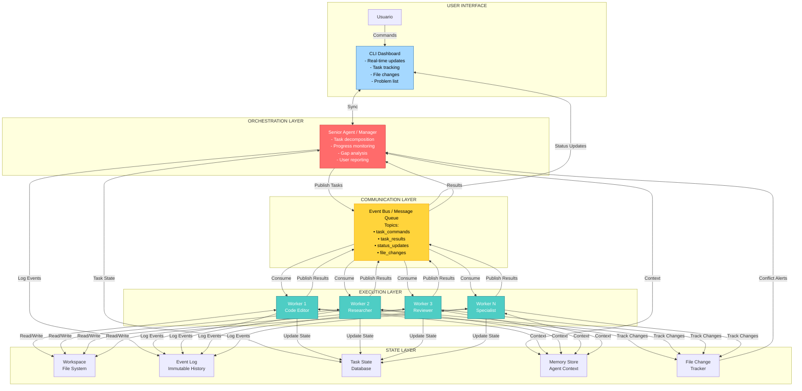
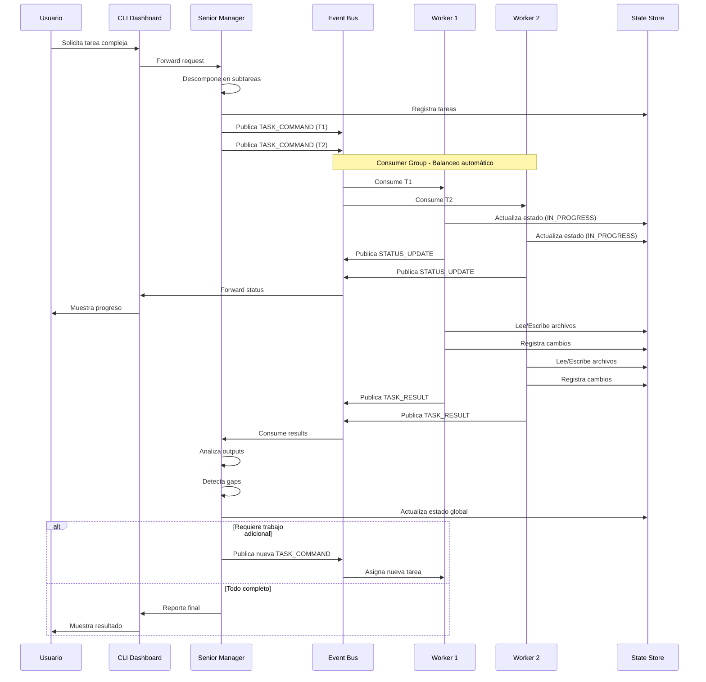
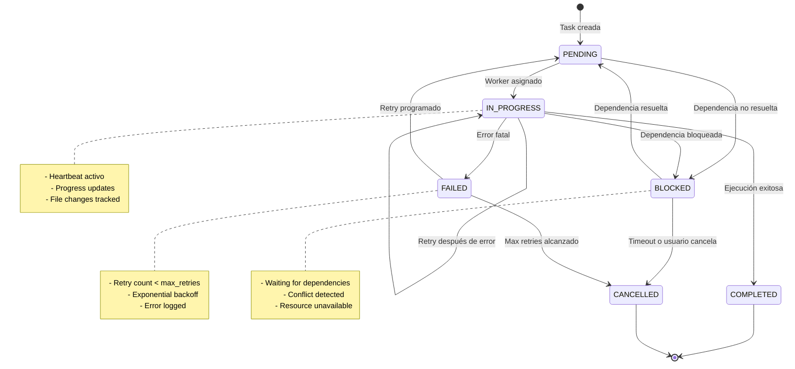
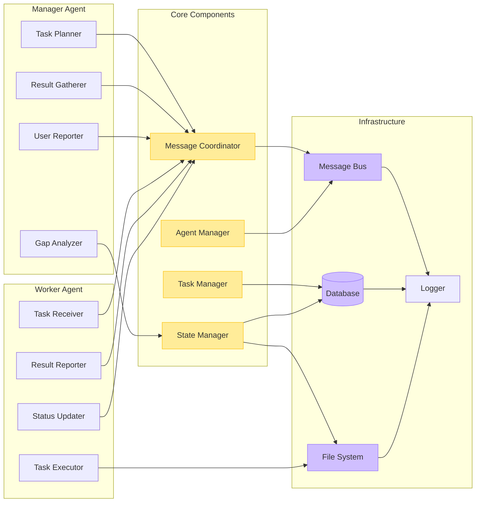
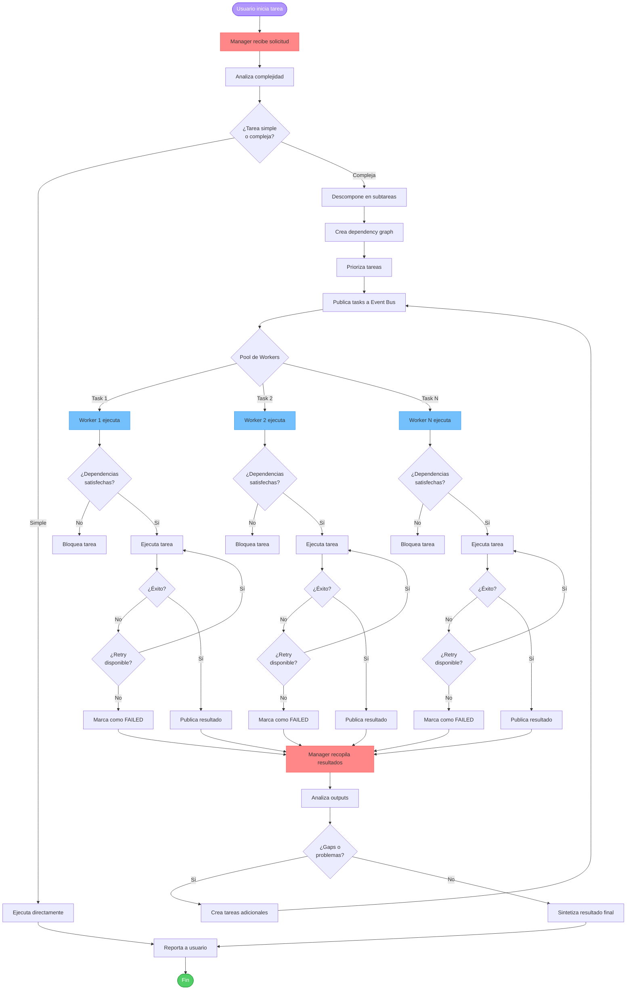
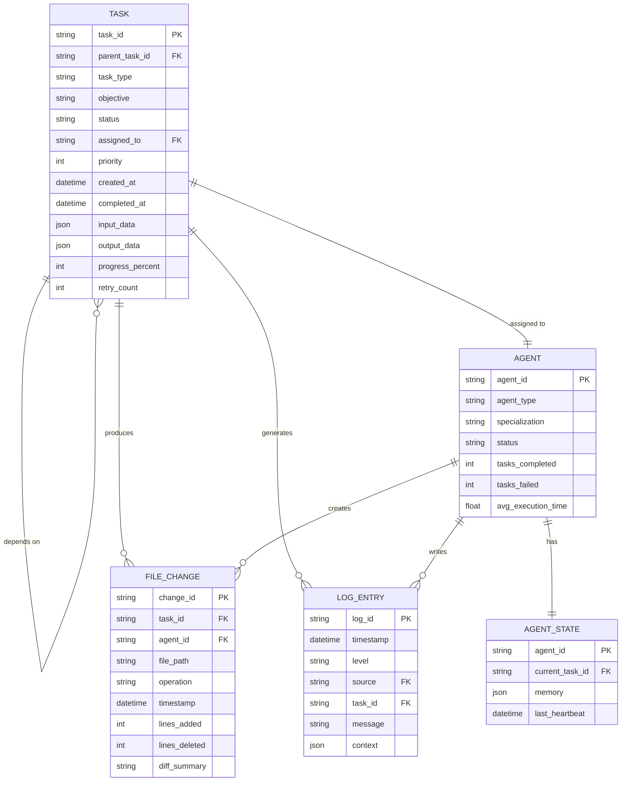
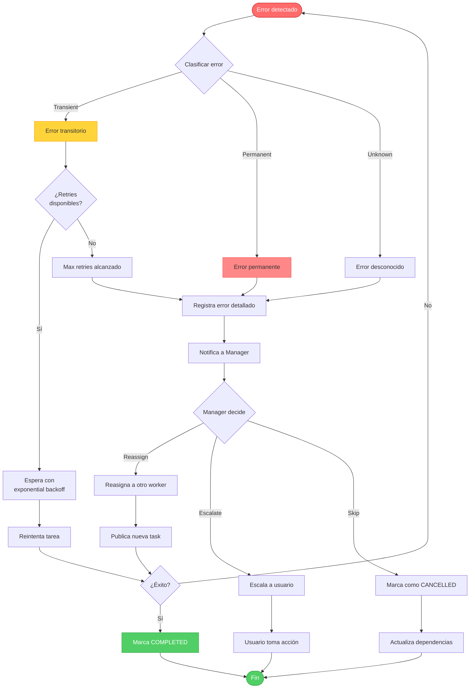

# Diagramas de Arquitectura - Sistema Multi-Agente

## 1. Arquitectura General del Sistema

## 2. Flujo de Comunicación Entre Agentes

## 3. Estados de Tarea (State Machine)

## 4. Arquitectura de Componentes

## 5. Flujo de Trabajo Detallado

## 6. Arquitectura de Datos (State Management)

## 7. Estrategia de Error Handling

---

## Próximos Pasos

1. [x] Diagramas de arquitectura completos
2. [ ] Mockup del CLI Dashboard
3. [ ] Implementación del código base
